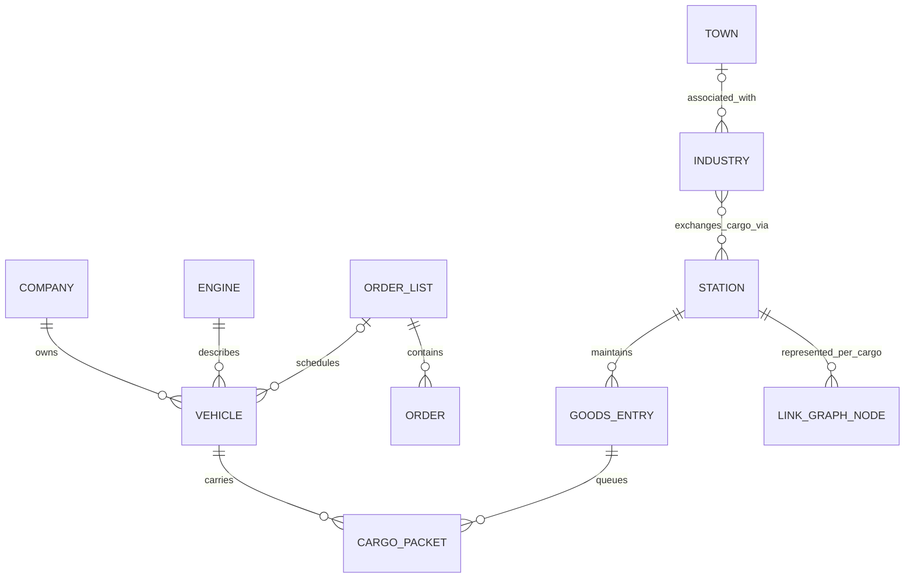

# SPEC-002: Ontology, taxonomy and data models

Status: Draft. Proposed Rust representations require validation against the reference implementation.

Assessment baseline: upstream `18fc940ebf4a837d8f510050774ec20a2acab63a`, inspected 2026-09-09.
This is an initial domain ontology and translation design, not a complete field-level schema or implemented Rust API. Upstream facts and proposed additions are distinguished below. The effort estimate is in [SPEC-001](001-port-scope-and-estimate.md).

## 1. Ontology: what exists and what it means

| Concept | Meaning in upstream | Identity and relationships | Evidence |
|---|---|---|---|
| World/map | Tile arrays and map dimensions, accessed through a tile wrapper | A `TileIndex` identifies a location, not a persistent entity | [map_func.h][map], [tile_type.h][tile] |
| Tile | Encoded terrain/infrastructure state at one location | Tile kind determines interpretation of shared storage fields; multi-tile objects reference entities | [map_func.h][map] |
| Company | Transport operator, finances, infrastructure ownership and settings | `CompanyID`; owns vehicles and infrastructure; contains AI runtime references as well as economic state | [company_base.h][company] |
| Town | Population/growth/local-authority and cargo-generation aggregate | `TownID`; relates to houses, industries and stations | [town.h][town] |
| House | Building instance represented through tile data and a house specification | House tiles contribute population and cargo generation; not a resident registry | [town.h][town], `src/house.h`, `src/town_map.h` |
| Industry | Running producer/consumer with accepted and produced cargo slots | `IndustryID`; associated town, footprint, nearby stations, optional neutral station, production histories | [industry.h][industry] |
| Industry specification | Definition used to construct and operate industry types | `IndustryType`; separate from an industry instance | `src/industrytype.h` |
| Base station | Common identity for station-like objects | Shared station pool supports stations and waypoints | `src/base_station_base.h`, `src/waypoint_base.h` |
| Station | Multimodal transport interchange with cargo state | `StationID`; facilities/footprint; one `GoodsEntry` per cargo type | [station_base.h][station] |
| Goods entry | Station's state for one cargo type | Rating, acceptance, cargo lists, flows, link graph membership; not one consignment | [station_base.h][station] |
| Depot | Maintenance/construction endpoint for vehicles | `DepotID` and map location; destination kind differs from a station | `src/depot_base.h`, [order_type.h][order-type] |
| Engine | Vehicle-model information plus changing availability/reliability state | `EngineID`; referred to by vehicle instances; not simply a stateless immutable blueprint | [engine_base.h][engine] |
| Vehicle | A physical vehicle component or special effect/disaster object | `VehicleID`; common state plus mode-specific state; may belong to a consist | [vehicle_base.h][vehicle], [vehicle_type.h][vehicle-type] |
| Consist | Related vehicle components treated operationally as a unit | Leading vehicle, linked components, shared orders/capacity behavior | [vehicle_base.h][vehicle], `src/base_consist.h` |
| Order list | Schedule shared by one or more vehicles | `OrderListID`; contains ordered `Order` values; reverse vehicle references are partly cached | [order_base.h][order] |
| Order | Destination/action policy and timetable information | Position within an order list; vehicle's current operational order can differ from planned list contents | [order_base.h][order], [order_type.h][order-type] |
| Cargo specification | Type-level properties: labels/classes/payment/acceptance behavior | `CargoType`; NewGRF can change the definition set | `src/cargotype.h` |
| Cargo packet | Batch of cargo with common origin/transport information | `CargoPacketID`; count, transit age, source, first station, next hop, distance/payment data; splits/merges | [cargopacket.h][packet], [cargopacket.cpp][packet-impl] |
| Source | Tagged cargo producer/consumer reference | Industry, town or company headquarters; not necessarily a station | `src/source_type.h` |
| Link graph | Cargo-specific transport connectivity and observed capacity/demand | Stations are nodes; vehicle service creates/updates links; jobs work on copied data | [linkgraph.h][linkgraph] |
| Command | Requested mutation with actor/context, validation, execution and outcome | Typed command dispatch, flags, costs/errors; not a domain event | [command_type.h][command], `src/command.cpp` |
| Simulation clock | Ordered ticks and date transitions | Tick, economy date, calendar date are separate concepts | [StateGameLoop][loop], [timer_game_common.h][time] |
| Random state | Deterministic and interactive random generators | Generator state and consumption order affect repeatability | `src/core/random_func.hpp`, `src/core/random_func.cpp` |
| NewGRF runtime | Content definitions and callbacks with persistent state | Changes simulation semantics, not just artwork | `src/newgrf.cpp`, `src/newgrf_storage.h` |
| Save/load representation | Versioned serialized records plus reconstruction/migration rules | Pool references, chunk handlers, afterload fixups and rebuilt caches | `src/saveload/saveload.h`, [cargopacket_sl.cpp][packet-save] |

Do not infer a workforce model from the words “passenger,” “town population,” or “AI.” Upstream passengers are cargo units. Population is an aggregate. An AI controls a transport company, not an individual worker.

## 2. Taxonomy: types must not be conflated

| Axis | Categories | Translation implication |
|---|---|---|
| Domain object role | Definition/catalogue; running entity; value; relationship; derived index; presentation | Separate these before assigning Rust ownership |
| Tile kind | Clear, Railway, Road, House, Trees, Station, Water, Void, Industry, TunnelBridge, Object | Preserve decoding and cross-kind rules; a level crossing is a Road tile |
| Vehicle kind | Train, Road, Ship, Aircraft; separately Effect and Disaster | Do not make every upstream vehicle a passenger-carrying asset |
| Cargo class | Passenger, freight and other class flags | Type classification does not provide unit identity |
| Movement layer | Physical track/water/airport path; vehicle order; cargo flow; proposed personal itinerary | These are four different routing problems |
| Time | Simulation tick; calendar date; economy date; presentation wall time; proposed operational duration | Use explicit units/conversions; no single `f64 time` |
| Identity | Tile address; pooled entity ID; type/catalogue ID; list position; external stable ID | Do not use one generic integer ID everywhere |
| State durability | Canonical saved state; reconstructible cache; presentation state; external observation | Decide per field; `NOSAVE` alone does not prove behavior is independent of it |
| Outcome | Command rejection; physical wait; transport arrival; platform authorization result | A denial is not a movement, and a full vessel is not a regulatory refusal |

The source-size taxonomy in [inventory.py](inventory.py) is intentionally different: it groups filenames for measurement, not domain ownership. For example, `src/viewport.cpp` lands in the residual application bucket and `src/network/network_gui.cpp` lands in networking. It cannot establish the size of a clean core by subtraction.

## 3. Relationships and cardinalities

This conceptual diagram omits polymorphism and temporary transition states. A live packet belongs to a single cargo container at a stable tick boundary; station and vehicle ownership are alternatives, not simultaneous containment. An engine definition/availability record is not the same as a locomotive instance. Vehicles without a usable order list and industries without an associated town must be represented explicitly rather than assigned invented IDs.

## 4. Proposed Rust data model and translation policy

| Upstream representation | Proposed Rust representation | Compatibility rule |
|---|---|---|
| Global entity pools and raw pointers | World-owned typed arenas; references through distinct ID newtypes | Preserve upstream pool allocation/iteration order in parity mode; changing to generational allocation is not automatically behavior-neutral |
| Invalid ID sentinels | `Option<...Id>` or validated wrapper internally; explicit codecs at boundaries | Preserve exact sentinel values in legacy import/export and command formats |
| Tile arrays with overloaded fields | Encapsulated packed storage plus typed accessors initially | Preserve masks, layout interpretation and rounding before attempting a more semantic storage layout |
| Vehicle inheritance/components | Common record plus mode-specific tagged state and explicit component links | Preserve distinction between order-bearing lead vehicle and cargo-bearing components |
| Shared order vectors and back pointers | Arena of order lists; vehicles refer to a list and current order state | Sharing survives editing, cloning and save/load; do not copy lists accidentally |
| Cargo packet pointer lists | Typed packet arena with station/vehicle containers and explicit split/merge operations | Conservation covers delivered, transferred, discarded and destroyed cargo, not just waiting/onboard totals |
| Mixed engine definition and availability | Immutable `VehicleSpec` plus `EngineAvailabilityState`, if callbacks allow the split | Document which values are dynamic before moving them to catalogues |
| Town/industry direct pointers | `TownId`, `IndustryId`, `StationId` relationships | Nullability, demolition and afterload reconstruction remain explicit |
| Money and scaled speeds | Integer newtypes and named conversion functions | Audit each arithmetic operation for wrapping, saturation, signedness and rounding; no generic “use floats” conversion |
| Global settings/current company | Explicit `Ruleset` and command context inside a world | Separate local preferences from settings that affect deterministic behavior |
| Timer callbacks and PRNG | World-owned clocks, stable phase/priority order, compatible PRNG state | Same seed is insufficient unless call order and arithmetic also match |
| Window invalidation/news from model code | Emitted effects consumed by presentation | First classify notifications: some control paths can affect execution and cannot merely be deleted |
| C++ saveload descriptors | Versioned native snapshots plus a separate OpenTTD codec/migration adapter | JSON/Serde snapshots do not establish `.sav` compatibility |
| NewGRF callbacks | Explicit rules/content interpreter with documented state access | Defer in subset scope; preserve callback semantics in compatibility scope |

At this commit, tile storage comprises an 8-byte base record and a 4-byte extension. A 4096² map therefore needs roughly 192 MiB for these arrays alone. Verify Rust layout and total memory with measurements; replacing every tile with a heap-heavy object or expansive enum may increase memory materially.

Proposed crate boundaries, not existing extracted modules:

| Crate | Owns | Must not depend on |
|---|---|---|
| `transport-types` | IDs, numeric units, primitive enums and errors | Host, renderer, network |
| `transport-world` | Map, entity storage, definitions and references | HTTP, UI |
| `transport-sim` | Commands, ordered ticks, construction, movement, economy, cargo | Wall-clock pacing, Grasida client, graphics |
| `transport-compat` | OpenTTD import/export, legacy encodings; later content compatibility | Product-specific compliance logic |
| `transport-people` | Optional persistent person/journey extension | Grasida legal rules; direct HTTP |
| `transport-api` | Versioned commands, projections, event/checkpoint transport | Rendering |
| `transport-oracle` | C++/Rust fixtures, canonical projections, differential runner | Shipping client dependencies |
| `transport-view` | Interactive presentation and user input | Ownership of authoritative movement |

Dependencies between world/sim/people need an ADR before implementation. A practical composition is for the world to store optional person state, and for a deterministic extension phase to provide transition proposals evaluated by sim; avoid a circular crate dependency or arbitrary mutation callbacks.

## 5. Persistent people: explicitly new semantics

These concepts are additions for GrasidaSim, not translated OpenTTD concepts:

| Entity/value | Minimum data | Lifecycle / invariant |
|---|---|---|
| `Person` | Stable external ID, current location, activity, links to assignments/journeys | Exists before and after travel; exactly one physical location |
| `Location` | At site/transfer point, walking leg, aboard vehicle, or explicitly outside modeled world | `Aboard` carries vehicle ID and journey-leg ID; no independent world position that can disagree with the vehicle |
| `Assignment` | Person, workplace, role, time window, plan revision | Intent to do work does not mean the person arrived or was authorized |
| `Journey` | Person, origin, destination, purpose, ordered legs and state | Can wait, board, travel, transfer, complete, cancel or be interrupted |
| `SeatReservation` | Vehicle/service leg, person, capacity class, validity | Reserved capacity and actual occupancy are distinct; never count a person twice |
| `BoardingRequest` | Request ID, person, vehicle, transfer point, intended crossing and state revision | Physical eligibility and external authorization are separate checks |
| `AuthorizationEvidence` | Request ID, decision, source, applicable crossing/time/revision | The host obtains it; deterministic input applies it; expired/stale evidence is rejected |
| `Manifest` | Vehicle and explicit boarded person IDs | Prefer a derived index from canonical person location; if stored, update transactionally and validate equality |
| `MovementEvent` | Run ID, monotonic sequence, tick, person/journey IDs, from/to, cause | Durable output sufficient for reconnect/replay; no duplicate movement on command retry |

Proposed crossing protocol:

1. A person reaches a transfer point with a valid journey; the core emits a boarding request without moving them.
2. Host asynchronously asks Grasida and records the answer. A blocked API call never runs inside the tick.
3. An input command supplies the answer with request/context identity at a defined simulation tick.
4. Core rechecks vehicle presence, remaining capacity, crossing usability and evidence applicability.
5. If valid, one transition updates location/reservation and emits `PersonBoarded`. A refusal leaves the person outside and demand outstanding.
6. The vehicle's actual arrival enables disembarkation/transfer; it does not immediately declare the task staffed. Required destination authorization is a separate crossing.

Keep the existing Grasida host's temporal contract explicit. Replayed authorization is for offline reproducibility; it does not make a historical approval current in a live run. Define an operational-time mapping before translating OpenTTD economy/calendar dates into shift durations. Original clocks and a new operational clock cannot all be silently equated.

For capacity, choose one policy: dedicated crew vehicles, or a shared seat pool where anonymous passenger units plus named occupants plus applicable reservations cannot overbook. Do not materialize a named person as cargo and count them again in the manifest.

Demolition, rerouting, breakdown, crash, company takeover, vehicle sale/autoreplace, save/load and station deletion all require explicit person outcomes. Named people must never vanish because a generic cargo packet was truncated or consumed by an industry. No automatic inference of real deaths from an in-game cargo deletion.

## 6. Compatibility modes

| Mode | Purpose | Expected equality |
|---|---|---|
| Legacy parity, people disabled | Validate Rust against pinned C++ | Equivalent canonical state and command outcomes at agreed boundaries |
| People extension | Model named crews and platform crossings | Extension invariants and scenario outcomes; deliberate divergence from vanilla passenger behavior |
| Presentation | Show either mode | No changes to simulation PRNG, commands or clocks solely because a viewer exists |

An upstream `.sav` contains no roster to recover. Import creates anonymous legacy cargo plus any separately supplied roster; it must not pretend counts contain historical person identities. Export to an unextended OpenTTD format must reject or explicitly declare loss of person state. Multiplayer peers must agree on the new state/rules; vanilla-client compatibility is not obtained merely by preserving vehicle packets.

## 7. Initial invariants and differential fixtures

| Boundary | Proof/check to establish |
|---|---|
| IDs and storage | Stable ownership, valid references, deterministic iteration, explicit deletion semantics |
| Commands | Validation does not spend money/move entities; applied result matches validated context or is revalidated |
| Cargo | Split/merge conserve count and payment accounting; source/next-hop semantics remain valid |
| Orders | Sharing and current-order state survive changes and save/load |
| Ticks | Repeat runs produce identical traces; clock priorities and PRNG states match the selected compatibility scope |
| People | One location per person; denied boarding leaves location unchanged; occupancy and reservations obey capacity |
| Restore | Interrupted/restarted run reproduces committed movements with no duplicate external effects |
| Viewers | Zero/one/multiple viewers do not change domain output |

Start differential fixtures with tile encode/decode, PRNG, dates, money rounding, cargo split/merge, then one dock-to-dock ship journey. Compare a normalized domain projection, not C++ object bytes against Rust object bytes. Record the first divergent tick and field; measure per-vehicle position/state, orders, cargo accounting, clocks and PRNG. Adopt deliberate ruleset differences separately from port defects.

The graph index is a discovery aid, not proof of dependency completeness. Several files were quarantined by the indexer and C++ overload/template calls can resolve imprecisely. The report uses inspected source for consequential claims.

[map]: https://github.com/OpenTTD/OpenTTD/blob/18fc940ebf4a837d8f510050774ec20a2acab63a/src/map_func.h
[tile]: https://github.com/OpenTTD/OpenTTD/blob/18fc940ebf4a837d8f510050774ec20a2acab63a/src/tile_type.h
[company]: https://github.com/OpenTTD/OpenTTD/blob/18fc940ebf4a837d8f510050774ec20a2acab63a/src/company_base.h
[town]: https://github.com/OpenTTD/OpenTTD/blob/18fc940ebf4a837d8f510050774ec20a2acab63a/src/town.h
[industry]: https://github.com/OpenTTD/OpenTTD/blob/18fc940ebf4a837d8f510050774ec20a2acab63a/src/industry.h
[station]: https://github.com/OpenTTD/OpenTTD/blob/18fc940ebf4a837d8f510050774ec20a2acab63a/src/station_base.h
[engine]: https://github.com/OpenTTD/OpenTTD/blob/18fc940ebf4a837d8f510050774ec20a2acab63a/src/engine_base.h
[vehicle]: https://github.com/OpenTTD/OpenTTD/blob/18fc940ebf4a837d8f510050774ec20a2acab63a/src/vehicle_base.h
[vehicle-type]: https://github.com/OpenTTD/OpenTTD/blob/18fc940ebf4a837d8f510050774ec20a2acab63a/src/vehicle_type.h
[order]: https://github.com/OpenTTD/OpenTTD/blob/18fc940ebf4a837d8f510050774ec20a2acab63a/src/order_base.h
[order-type]: https://github.com/OpenTTD/OpenTTD/blob/18fc940ebf4a837d8f510050774ec20a2acab63a/src/order_type.h
[packet]: https://github.com/OpenTTD/OpenTTD/blob/18fc940ebf4a837d8f510050774ec20a2acab63a/src/cargopacket.h
[packet-impl]: https://github.com/OpenTTD/OpenTTD/blob/18fc940ebf4a837d8f510050774ec20a2acab63a/src/cargopacket.cpp
[packet-save]: https://github.com/OpenTTD/OpenTTD/blob/18fc940ebf4a837d8f510050774ec20a2acab63a/src/saveload/cargopacket_sl.cpp
[linkgraph]: https://github.com/OpenTTD/OpenTTD/blob/18fc940ebf4a837d8f510050774ec20a2acab63a/src/linkgraph/linkgraph.h
[command]: https://github.com/OpenTTD/OpenTTD/blob/18fc940ebf4a837d8f510050774ec20a2acab63a/src/command_type.h
[loop]: https://github.com/OpenTTD/OpenTTD/blob/18fc940ebf4a837d8f510050774ec20a2acab63a/src/openttd.cpp#L1207
[time]: https://github.com/OpenTTD/OpenTTD/blob/18fc940ebf4a837d8f510050774ec20a2acab63a/src/timer/timer_game_common.h
